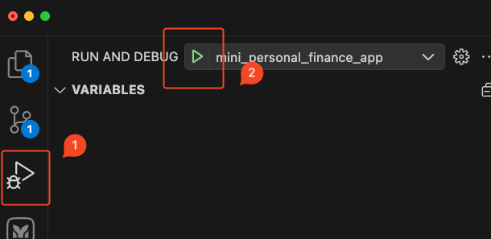

# mini_personal_finance_app

## Project Description

Actually, I prefer this way [Development-Guideline](https://gist.github.com/panachainy/9ee622e2e13b574f08255b26e2c8b838)

For modular & split by features

## Installation Instructions

- You must have Flutter, Xcode, FirebaseAccount for testing on iOS
- Clone the repository
- Run `flutter pub get` to install dependencies
- Configure Firebase for your project (follow the [Firebase setup guide](./FIREBASE_SETUP.md))

## Usage Instructions

## Testing Instructions

- Didn't have time to do the test my bad

## Additional Notes

### Disclaimer

In in normally we use PR for development & split commit with what we do then merge PR to main branch via squash & merge
But in this case, I need speed for development, So I just commit to dev branch directly.

I do this repository via my knowledge & AI some help.

### Design

- widgets is dump widget, no logic inside
- bloc is state management, for manage state & logic & event
- datasource I decide to use Firebase.Firestore is support both offline & online
